# Code and Mathematical Evidence for ADSA Claims

This document provides direct mathematical formulations, code evidence, and deep intuitive explanations for the architectural claims made in the traceability reports. It maps the theoretical paradigm shifts directly to their implementation in the ADSA repository, serving as an explicit defense of the engineering decisions.

---

## 0. High-Level Architecture

```mermaid
graph TD
    subgraph Stage 2: Embedder
        I[Input Image] --> ASM[Adaptive Semantic Masker]
        I --> DAE[Dual VAE Encoder]
        DAE --> Z[Latent Bottleneck z]
        ASM -.->|Scales Strength| WM[Chaotic Watermark]
        WM -->|Injects| Z
        Z --> DAD[Dual VAE Decoder]
        DAD --> IW[Watermarked Image]
    end

    subgraph Stage 3: Multi-Task Extractor
        IW --> RN[ResNet-34 Backbone]
        RN --> H1[Integrity Head <br> Dense Spatial Map]
        RN --> H2[Identity Head <br> Separated Feature Vector]
        RN --> H3[Global Triage Head <br> 4-Class Output]
        RN --> H4[Latent Shift Head <br> FFT Spectrum Aligned]
    end
```



---

## 1. Probabilistic Latent Formulation (VAE)

**The Claim:** 
Because deterministic methods failed to preserve the watermark against structural attacks, the VAE formulation was adopted as an experimental fix. It organizes the latent space such that small, high-frequency watermark perturbations are preserved rather than suppressed as ambient noise.

**Mathematical Expression:**
The latent representation $z$ is sampled from a parameterized Gaussian distribution:
$$z = \mu + \epsilon \cdot e^{\frac{1}{2} \log(\sigma^2)}, \quad \epsilon \sim \mathcal{N}(0, I)$$

**Code Evidence (`dual_autoencoder_module/jup_notebooks/stage2_ae_training.py`):**
```python
self.fc_mu = nn.Linear(512 * 8 * 8, latent_dim)
self.fc_logvar = nn.Linear(512 * 8 * 8, latent_dim)

def reparameterize(self, mu, logvar):
    std = torch.exp(0.5 * logvar)
    eps = torch.randn_like(std)
    return mu + eps * std
```

---

## 2. Adaptive Semantic Masking

**The Claim:** 
Adaptive masking was adopted to ensure that embedding strength is proportional to localized edge and variance energy, significantly reducing visual artifacts in smooth regions.

**Deep Dive & Intuitive Explanation:**
*   **Proportional Energy:** Embedding strength is calculated via localized edge energy (sudden intensity changes) and variance energy.
*   **Intuitive Analogy:** Imagine whispering a secret. In a quiet library (smooth region), even a whisper stands out. In a crowded marketplace (textured region), you can speak louder and nobody notices. Adaptive masking is like adjusting your voice depending on the environment.

**Mathematical Expression:**
$$M(x,y) = \sigma\Big( \text{Pool}(|\nabla_x I| + |\nabla_y I|) + \text{Var}(I) \Big)$$

---

## 3. Watermark-Aware Spectrum-Aligned (FFT) Loss

**The Claim:** 
Standard spatial MSE explicitly fails the objective of robust embedding because it treats the subtle watermark perturbation as noise. The FFT loss was adopted as an experimental fix to align the magnitude spectrum.

**Deep Dive & Intuitive Explanation:**
*   **Intuitive Analogy:** Standard MSE is like trying to hide a whisper in a song by matching the lyrics word-for-word. The whisper gets lost. Spectrum-aligned loss is like matching the frequency profile of the whisper—ensuring the hidden vibration survives inside the music.

**Mathematical Expression:**
$$L_{spec} = \left\| |\mathcal{F}(\Delta z_{pred})| - |\mathcal{F}(\Delta z_{target})| \right\|_1$$

---

## 4. Multi-Task Forensic Triage Network (Failing Deepfake Detection)

**The Claim:** 
Previous baseline methods utilizing binary detectors fail the ultimate objective of deepfake detection. Deepfakes are macroscopic structural manipulations; a binary model trained on pixel noise is blind to these real-world threats. The multi-task network was adopted as an observational correction to recognize semantic integrity violations.

**Deep Dive & Intuitive Explanation:**
*   **The Failure of Binary Baselines:** A binary "Yes/No" output provides zero diagnostic utility. If an image is flagged, you don't know *where* it was tampered or *how*. 
*   **The Multi-Task Fix:** One architecture shares a backbone but has specialized heads (localization, identity recognition, triage).
*   **Intuitive Analogy:** Think of it like a detective’s toolkit. The dense spatial map (`integrity_head`) is the magnifying glass showing exactly where the crime scene evidence lies. The separated feature vector (`identity_head`) is the fingerprint database that tells who the suspect is. The multi-task network is the detective who can do both jobs at once.

**Code Evidence (`CNN_Extractor_&_Attack_simulation/jup_notebooks/train_extractor_pretrained_synced.py`):**
```python
# The ResNet-34 backbone splits into multiple forensic heads to solve 
# the diagnostic failure of previous binary methods
self.integrity_head = nn.Sequential(...)  # Dense Spatial Map (Where)
self.detector_head = nn.Sequential(...)   # 4-Class Triage (What)
self.identity_head = nn.Sequential(...)   # Separated Feature Vector (Who)
```
